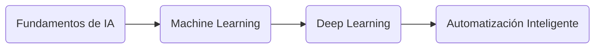

# 📘 Guía para la Creación de Cursos Estructurados y Automatizados

> **“Diseñar un curso no es escribir contenido, es construir una experiencia de aprendizaje que evoluciona.”**

---

## 🎯 Propósito del Documento

Esta guía define el **proceso estándar para crear nuevos cursos** siguiendo criterios de calidad, consistencia y automatización.  
Aplica a cualquier temática o rama tecnológica, manteniendo el mismo **formato pedagógico, técnico y cognitivo**.

---

## 🧩 1. Estructura General del Proceso

El proceso de creación de un curso se divide en **cuatro fases** principales:

| Etapa                              | Descripción                                                                       | Resultado Esperado                                 |
| ---------------------------------- | --------------------------------------------------------------------------------- | -------------------------------------------------- |
| 🧭 **1. Roadmap y Temario**        | Definir la estructura temática global, objetivos y fases de conocimiento.         | Archivo `curso.yaml` inicial.                      |
| 🧠 **2. Desglose Conceptual**      | Profundizar en cada tema con preconceptos, subtemas y conexiones lógicas.         | Mapa detallado de contenidos (roadmap.md).         |
| 🧱 **3. Modularización**           | Crear carpetas y archivos por módulo, con objetivos, laboratorios y evaluaciones. | Estructura base en `/phases` lista para versionar. |
| 🧰 **4. Desarrollo del Contenido** | Redactar teoría, prácticas, ejemplos y casos reales según la plantilla.           | Módulos completos y validados.                     |

---

## 📁 2. Estructura del Repositorio

Todo curso debe seguir esta **estructura estandarizada**, que permite automatización y versionamiento.

```

📦 curso-[nombre-tematica]/
│
├── README.md                  # Descripción general, objetivos y progreso
├── curso.yaml                 # Archivo maestro de configuración
├── LICENSE                    # Licencia MIT
├── .gitignore                 # Ignorar archivos temporales
│
├── assets/                    # Imágenes, diagramas y recursos gráficos
├── docs/                      # Documentación pedagógica y metodológica
├── phases/                    # Carpetas por módulo o fase
├── evaluations/               # Rúbricas, tests y criterios de evaluación
└── community/                 # Contribuciones, soporte y certificaciones

```

---

## 🧱 3. Paso 1 — Definir el Roadmap del Curso

El **roadmap** representa la hoja de ruta cognitiva del curso.  
Debe reflejar progresión **de lo básico a lo avanzado**, con una secuencia clara de temas.

### ✅ Instrucciones

1. Crea el archivo `curso.yaml` con los siguientes campos:

   - `nombre`, `descripcion`, `version`, `autor`, `estado`.
   - `objetivos`: lista de 6-8 objetivos medibles.
   - `prerrequisitos`: conocimientos y herramientas requeridas.
   - `estructura`: lista de fases con duración, tipo y número de archivos.
   - `evaluacion`: checklist y criterios de completado.

2. Cada fase debe tener una **descripción corta**, un **tipo** (conceptual, hands-on, técnico) y una **duración estimada**.

3. Ejemplo simplificado:

```yaml
curso:
  nombre: "Fundamentos de IA y Automatización"
  version: "1.0"
  estado: "EN DESARROLLO"
  descripcion: "Curso introductorio a IA aplicada y automatización de procesos."
  autor: "Andrés Olarte"

estructura:
  fases:
    - id: "01"
      nombre: "Fundamentos de IA"
      duracion: "8 horas"
      tipo: "Teórico"
```

---

## 🧠 4. Paso 2 — Generar el Temario Detallado

El temario profundiza el roadmap, detallando **subtemas, dependencias y objetivos específicos**.

### ✅ Instrucciones

1. Crea un archivo `docs/roadmap.md` con la estructura:

   - Introducción del curso.
   - Tabla de fases → semanas → temas → duración.
   - Objetivos por fase (acción + resultado medible).
   - Diagrama Mermaid que muestre progresión cognitiva.

2. Ejemplo de tabla temática:

| Semana | Tema Principal    | Subtemas                             | Tipo       | Duración |
| ------ | ----------------- | ------------------------------------ | ---------- | -------- |
| 1      | Fundamentos de IA | Historia, tipos de IA, usos actuales | Conceptual | 8h       |
| 2      | Machine Learning  | Algoritmos, datasets, métricas       | Hands-on   | 10h      |

3. Ejemplo de diagrama (Mermaid):



---

## 🧩 5. Paso 3 — Modularización del Curso

Cada módulo debe ser una **unidad autosuficiente** con teoría, práctica y evaluación.

### ✅ Estructura por módulo

```
📁 phases/01-fundamentos-ia/
│
├── README.md            # Contenido principal del módulo
├── labs.md              # Ejercicios y prácticas hands-on
├── recursos.md          # Referencias y materiales externos
├── evaluacion.md        # Evaluación del módulo
└── assets/              # Imágenes o diagramas específicos
```

### ✅ Contenido mínimo por módulo

| Sección               | Descripción                                       | Formato        |
| --------------------- | ------------------------------------------------- | -------------- |
| Introducción          | Contexto del módulo y propósito                   | Markdown       |
| Objetivos específicos | Verbos de acción (Definir, Implementar, Evaluar…) | Lista          |
| Explicación teórica   | Contenido técnico y conceptual                    | Texto + código |
| Ejemplos prácticos    | Casos aplicados, scripts, notebooks               | Código         |
| Mejores prácticas     | Guía de estándares, errores comunes               | Checklist      |
| Evaluación            | Preguntas o ejercicios de cierre                  | Markdown       |

---

## 🧮 6. Métricas de Calidad (QA Checklist)

Cada curso debe cumplir con los siguientes **criterios técnicos y pedagógicos**:

| Categoría         | Métrica                                          | Estado |
| ----------------- | ------------------------------------------------ | ------ |
| 📂 Estructura     | Consistencia de carpetas y nombres               | [ ]    |
| 🧱 Modularización | Todos los módulos con README + labs + evaluación | [ ]    |
| 🧠 Contenido      | Explicaciones detalladas y contextualizadas      | [ ]    |
| 💡 Prácticas      | Ejemplos funcionales y verificables              | [ ]    |
| 🔐 Seguridad      | Sin datos sensibles ni claves expuestas          | [ ]    |
| 🧰 Automatización | curso.yaml validado por `validate_yaml.py`       | [ ]    |
| 🎨 Diseño         | Markdown limpio, headers jerárquicos, emojis     | [ ]    |
| 📊 Evaluación     | Criterios de completado y rúbricas claras        | [ ]    |
| 🧾 Documentación  | README y roadmap actualizados                    | [ ]    |
| 🧭 Navegación     | Enlaces previos y siguientes funcionales         | [ ]    |

---

## ⚙️ 7. Automatización del Proceso

### Scripts recomendados

| Script                        | Descripción                                                |
| ----------------------------- | ---------------------------------------------------------- |
| `scripts/generate_course.py`  | Crea carpetas y archivos a partir de `curso.yaml`.         |
| `scripts/validate_yaml.py`    | Valida que todos los módulos y campos cumplan el estándar. |
| `scripts/export_md_to_pdf.sh` | Genera PDFs estáticos para distribución o LMS.             |

### Ejemplo de uso

```bash
python scripts/generate_course.py curso.yaml
python scripts/validate_yaml.py curso.yaml
```

---

## 🧩 8. Estándares de Redacción

- Usa un tono profesional y pedagógico.
- Combina lenguaje técnico con ejemplos reales.
- Usa **bold** para conceptos clave y _italic_ para matices.
- Separa secciones con `---` y usa emojis para mejorar legibilidad.
- Evita contenido genérico; cada módulo debe aportar valor nuevo.

---

## 🏁 9. Publicación y Versionado

1. Confirma que todos los checklists están completados.
2. Ejecuta validaciones automáticas (`validate_yaml.py`).
3. Actualiza fecha de última modificación en el `curso.yaml`.
4. Realiza commit y push al repositorio:

```bash
git add .
git commit -m "🧩 Curso IA y Automatización - versión inicial"
git push origin main
```

5. Usa **tags semánticos** para versiones (`v1.0`, `v1.1`, etc.).

---

## 🧭 10. Conclusión

Este formato garantiza que todos los cursos desarrollados:

- Sean **coherentes, modulares y medibles**.
- Sigan un **proceso reproducible y automatizable**.
- Cumplan con las **mejores prácticas de aprendizaje 70-20-10**.
- Mantengan un estándar profesional, tanto pedagógico como técnico.

> **“La calidad no se inspecciona al final, se diseña desde el inicio.” — W. Edwards Deming**

---

📅 **Última actualización:** `{{fecha_actual}}`
📜 **Licencia:** MIT
✍️ **Autor:** Andrés Olarte

---
